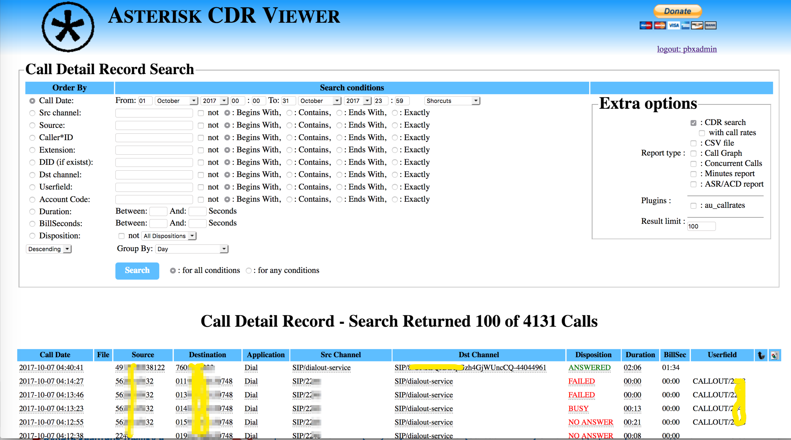
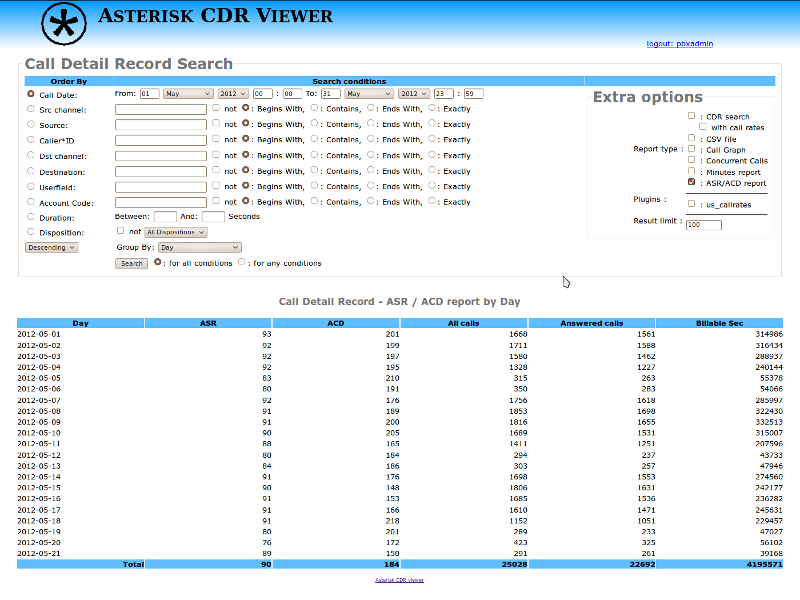
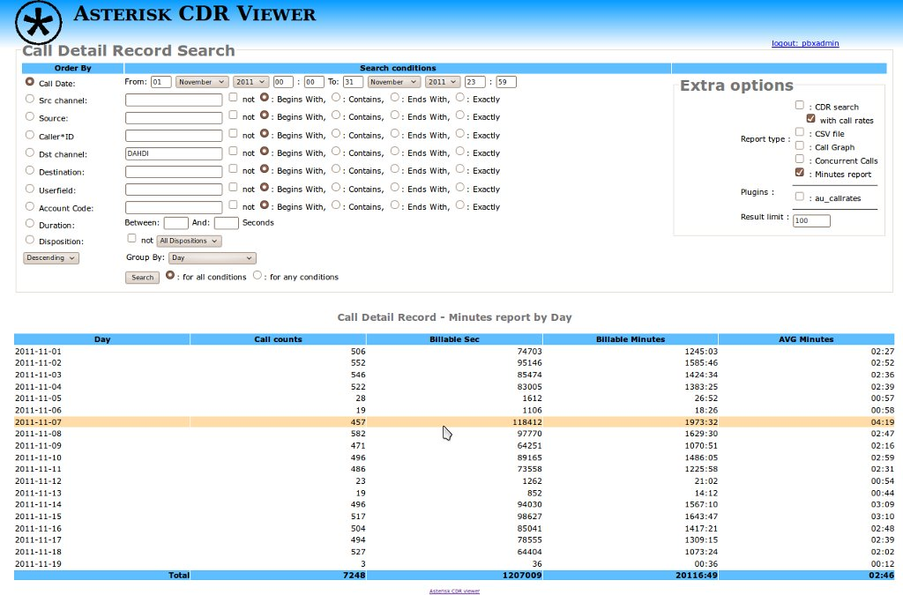
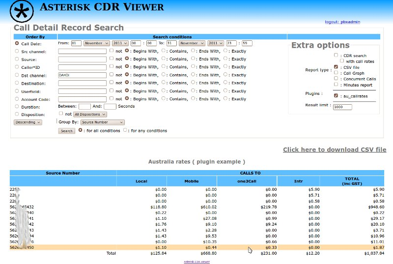

Простой и быстрый просмотрщик CDR для Астериск. ( 1.0.16, Jan 16 2022 )

    Русский язык интерфейса

    Поддержка регулярных выражений Asterisk ( like _XNZ. ) для номеров источника/получателя/DID.

    PHP без каких-либо дополнительных зависимостей.

    Простота установки и использования.

    На основе CSS.

    Режим "Пользователь / Администратор"

    Поддержка плагинов для пользовательских отчетов.

    Поддержка ASR

Основной код взять из https://github.com/g613/asterisk-cdr-viewer
